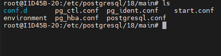

## SGBD
```bash
SUDO apt install 
```
# 5432 --> 
---
realizando verificação
``` bash
pg_lsclusters
```
para realizar o acesso do sgbd comando:
``` bash
sudo -u postgres psgl
```
> com esse comando, o acesso e feito sem senha, pois o linux ja provou quem você é(root). autenticação PEER
```sql
ALTER USER postgres PASSWORD '1234';
```
> o retorno correto é 'ALTER ROLE'
para sair comando `\q`

# passo1

caminho padrãoi para sql


```bash
sudo nano postgres.conf
```
# listen_addresses: 
mostra de onde devo "escutar" as conections.

- ctrl + w para buscar a linha precisa
- se ficar localhost, somente meu pc acessa.
"rede da sala: 10.87.38"

# passo 2
```bash
sudo nano pg_hba.conf
```
nas ultimas linhas, adicionei:
host all all 10.87.38.0/24
---

## configuração de serviço
A senha do meu banco de dados é 4321
- para criar um banco de dados, usamos o comando:
```sql
CREATE DATEBASE lojamax
```
- para visualizar os bancos:

para visualizar os bancos:

```bash
\q
```