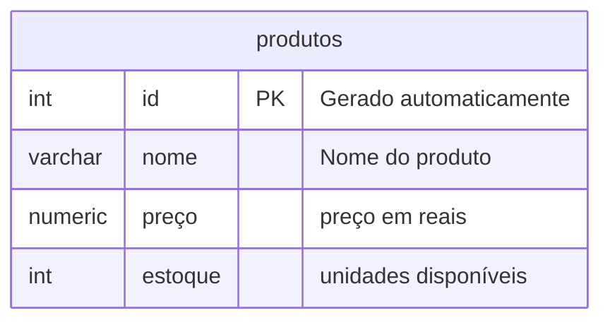

 ### comando para apagar um banco de dados
```sql
DROP DATABASE lojamax;
```
### para criar banco de dados
```sql
CREATE DATABASE loja;
```
---
o principal objetivo e criar uma loja para aprender os principais comandos SQL

PARA CRIar a tabela utilizamos oso comandos abaixos

```sql
CREATE TABLE produtos(
    id INT GENERATED ALWAYS AS IDENTITY PRIMARY KEY,
    nome VARCHAR(50) NOT NULL,
    preço NUMERIC(10,2) NOT NULL,
    estoque INT NOT NULL DEFAULT 0
);
``` --> criando uma tabela
-- para inserir dados na tabela, comamdo:
```sql
INSERT INTO produtos(nome,preço,estoque)
VALUES('iphone 17','10000.00','15');
```
